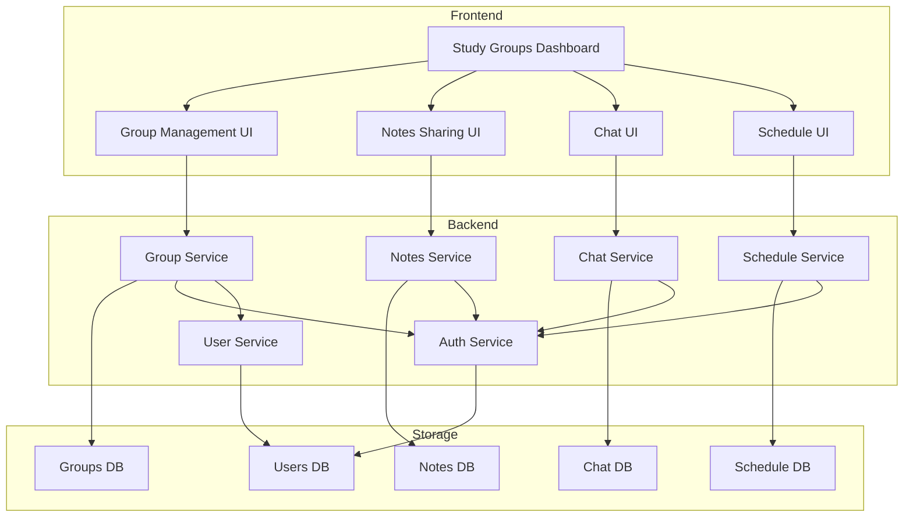
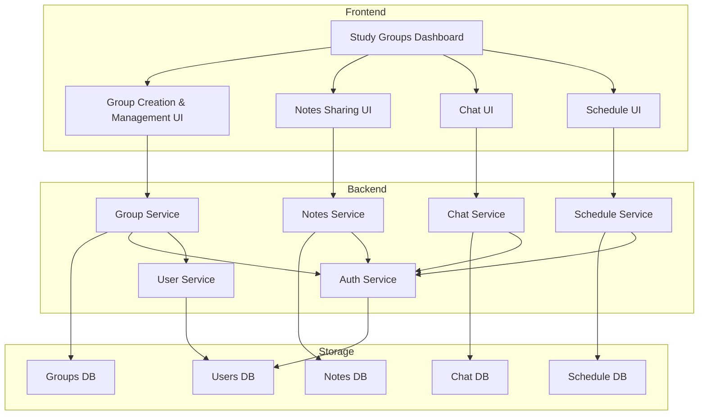

# NotesVault Study Groups - MVP Architecture

## Overview

This document outlines the architecture for the **core Study Groups** feature in NotesVault, designed to be modular and extensible for future AI-powered tools and collaboration features.

---

## MVP Scope

- Create **public/private** study groups
- Invite members
- Share notes
- Group chat
- Schedule study sessions
- Dedicated **Study Groups Dashboard**

---

## High-Level Architecture

---

## Module Responsibilities

### Auth Service
- User login/signup
- JWT tokens
- Role validation

### User Service
- User profiles
- Invitations
- Membership management

### Group Service
- Create, update, delete groups
- Privacy settings
- Membership roles

### Notes Service
- Upload/share notes
- Permissions
- Document style copying (future)

### Chat Service
- Real-time chat
- Message history

### Schedule Service
- Create/view study sessions
- Calendar integration

---

## Future Features & Integration Points

- **Exam Paper Predictor:** Connects to AI service analyzing PYQs, outputs scores and reasoning.
- **Assignment System:** AI-assisted assignment management, plagiarism detection, topic suggestions.
- **Timetable Manager:** Exam schedule, buffer predictor, integrated with study groups.
- **Dashboard Access Control:** Rate limits, paid features, guest vs logged-in.
- **Document Style Copying:** Replicate formatting/styles of exam papers.
- **AI Tools:** Flashcard generator, podcast creator, question predictor.

---

## Design Principles

- Modular microservices or well-separated modules
- API-driven, no secrets or hardcoded env values
- Extensible for future AI and collaboration features
- Role-based access control
- Clean separation of concerns

---

*Generated on 2025-04-07 18:48 IST*

## MAIN IDEA

### **NotesVault Study Groups MVP - Architecture Design**

#### **Core Features**
- Create **public/private** groups
- **Invite** others
- **Share notes**
- **Chat**
- **Schedule study sessions**
- Dedicated **Study Groups Dashboard**

---

### **Design Principles**
- Modular, extensible foundation for future AI tools, assignment system, timetable, etc.
- Clean separation of **core group management**, **content sharing**, **communication**, and **scheduling**
- API-driven, no secrets or hardcoded env values
- Frontend and backend decoupled, with clear API contracts
- Role-based access (owner, member, guest)

---

### **Architecture Components**

---

### **Module Responsibilities**

- **Auth Service:** User login/signup, JWT tokens, role validation
- **User Service:** Profile, invitations, membership management
- **Group Service:** CRUD groups, privacy settings, membership roles
- **Notes Service:** Upload/share notes, permissions
- **Chat Service:** Real-time/group chat, message history
- **Schedule Service:** Create/view study sessions, calendar integration

---

### **Integration Points for Future Features**

- **AI Services:** Connect to Exam Predictor, Assignment AI, Timetable AI
- **Payment/Rate Limits:** API gateway enforces limits for logged-out users
- **Assignment System:** Extend Group & Notes services
- **Timetable Manager:** Extend Schedule service
- **Document Style Copying:** Extend Notes service with formatting metadata

---

### **Next Step**

Document this architecture in the Memory Bank for persistent context, then proceed to detailed API design and data models.
