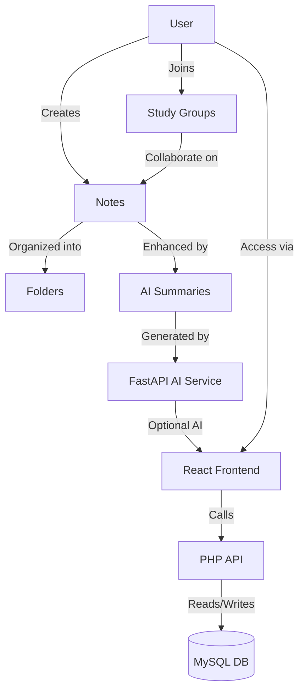
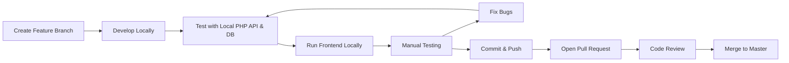
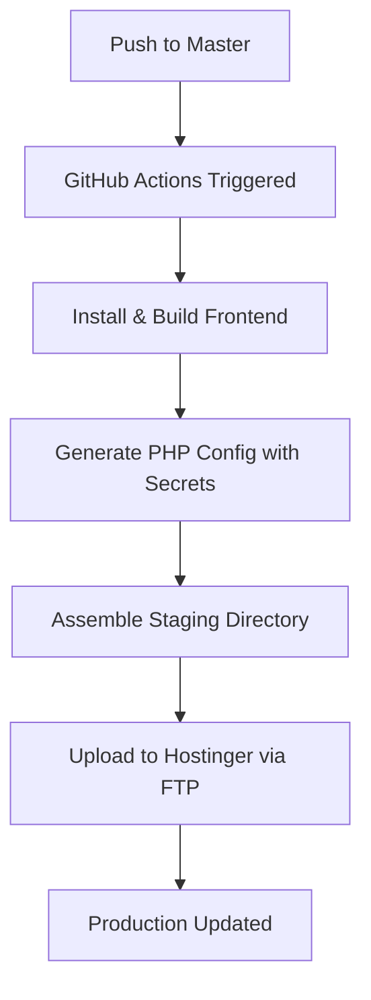
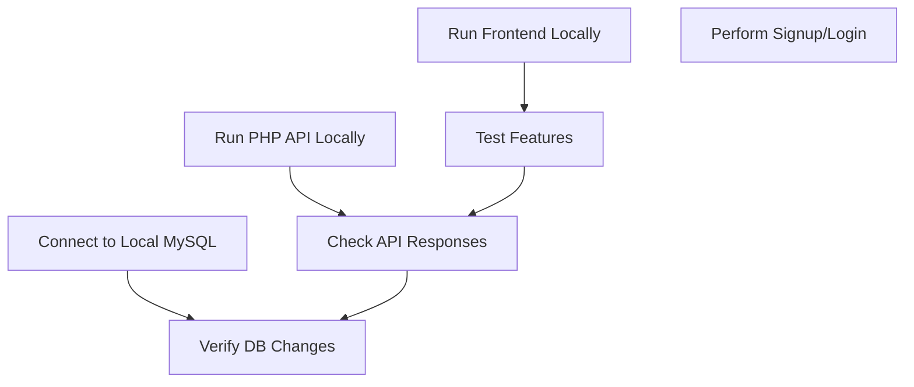

# NotesVault - Full Stack MVP

---

## 🌟 NotesVault Concept



---

## Overview

NotesVault is a web platform for note management, document generation, and study collaboration.

This MVP includes:

- **React Frontend** (Vite, TypeScript, CSS Modules)
- **PHP API Backend** (JWT Auth, MySQL)
- **MySQL Database**
- **Automated Deployment to Hostinger**
- **Experimental FastAPI Backend** (future AI features)

---

## 🏗️ Overall Architecture

```mermaid
graph TD
    subgraph Frontend
        A[React + Vite]
    end
    subgraph Backend
        B[PHP API]
        C[FastAPI (Experimental)]
    end
    subgraph Database
        D[(MySQL)]
    end
    A -->|REST API| B
    A -->|Future AI| C
    B --> D
    C --> D
```

---

## Architecture

### Frontend

- React 19, Vite, TypeScript
- CSS Modules for styling
- React Router DOM v7
- Context API for theme
- Communicates with `/api/` endpoints

### Backend API (Production)

- PHP scripts (`api/`)
- JWT-based authentication
- Password hashing with bcrypt
- MySQL database
- `.htaccess` routes `/api/` to PHP, others to React SPA

### Experimental Backend (Local Dev)

- FastAPI (Python)
- Google OAuth verification
- AI integration (Google Generative AI)
- Celery + Redis for background tasks
- Not yet integrated into production

### Deployment

- GitHub Actions CI/CD
- Builds React app
- Generates production PHP config with secrets
- Uploads to Hostinger `/public_html/` via FTP
- Secrets injected dynamically, **never stored in repo**

---

## Installation

### Frontend

```bash
cd notesvault-react-mvp
npm install
npm run dev
```

- Runs on `http://localhost:5174`
- Proxies `/api` requests to backend (configure in `vite.config.ts`)

### Backend API (PHP)

- Requires PHP 7.4+
- Setup MySQL database
- Create `api/config.php` with DB credentials or use deployment secrets
- Import database schema (SQL not included here)

### Experimental FastAPI Backend

```bash
cd backend
python -m venv venv
source venv/bin/activate  # or venv\Scripts\activate on Windows
pip install -r requirements.txt
uvicorn main:app --reload --port 8000
```

- Requires Python 3.8+
- Set environment variables in `.env` (e.g., `GOOGLE_CLIENT_ID`)

---

## 🛠️ Development Workflow



---

## Development Setup

- Run **frontend** and **FastAPI backend** locally for development
- For PHP API, use local PHP server or deploy to Hostinger
- Configure CORS and API URLs accordingly
- Use GitHub secrets for production credentials

---

## 🚀 Deployment Pipeline



---

## Deployment Process

- Push to `master` branch triggers GitHub Actions workflow
- Workflow:
  - Checks out code
  - Installs frontend dependencies
  - Builds React app (`npm run build`)
  - Generates `api/config.prod.php` with secrets
  - Assembles staging directory with:
    - React build output
    - `.htaccess`
    - PHP API files
    - Generated config
  - Uploads to Hostinger `/public_html/` via FTP
  - Cleans up old files, ensures atomic deploy
- Secrets:
  - Stored in GitHub Secrets
  - Injected during deploy
  - Never stored in repo

---

## 🧪 Testing Flow



---

## Known Issues & Caveats

- Hostinger only supports PHP backend; FastAPI backend is **not deployed** yet
- Initial login errors fixed by proper PHP config and JWT secret management
- Deployment deletions fixed by atomic staging directory
- Passwords hashed with bcrypt
- JWT expiration configurable
- Database schema setup required (SQL not included here)
- Tailwind CSS config present but **not used** (switched to CSS Modules)
- Google OAuth only supported in FastAPI backend (experimental)
- `.env` files **not committed**; configure locally or via secrets

---

## Project Structure (Frontend)

```
notesvault-react-mvp/
├── public/             # Static assets
├── src/
│   ├── assets/         # Vite-processed assets
│   ├── components/     # Shared UI components
│   │   ├── layout/     # Navbar, Footer
│   │   └── ui/         # Buttons, Icons, Background
│   ├── context/        # React Context providers
│   ├── features/       # Feature-specific components
│   ├── hooks/          # Custom hooks
│   ├── pages/          # Route components
│   ├── App.css
│   ├── App.tsx
│   ├── index.css
│   ├── main.tsx
│   └── vite-env.d.ts
├── .gitignore
├── eslint.config.js
├── index.html
├── package.json
├── postcss.config.cjs
├── tailwind.config.js
├── tsconfig.app.json
├── tsconfig.json
├── tsconfig.node.json
└── vite.config.ts
```

---

## Available Frontend Scripts

- `npm run dev` - Start Vite dev server
- `npm run build` - Build production bundle
- `npm run lint` - Run ESLint
- `npm run preview` - Preview production build

---
## Local Development & Testing Workflow

Before pushing any changes, follow this workflow to ensure stability:

### 1. Setup Local Environment

- **Frontend:**
  - Run `npm run dev` in `notesvault-react-mvp/`
  - Access at `http://localhost:5174`
- **PHP API:**
  - Use local PHP server (e.g., `php -S localhost:8001 -t api/`)
  - Or deploy to a staging server
- **Database:**
  - Use a local MySQL instance
  - Import the latest schema
  - Update `api/config.php` with local DB credentials
- **FastAPI Backend (optional):**
  - Run `uvicorn main:app --reload --port 8000`

### 2. Develop Features

- Create a new feature branch
- Implement changes in frontend/backend
- Use environment variables for secrets
- Avoid hardcoding credentials

### 3. Test Locally

- **Frontend:**
  - Verify UI changes
  - Check API calls work (signup, login, data fetch)
- **Backend (PHP API):**
  - Test endpoints via frontend or tools like Postman
  - Check signup/login flows
  - Verify JWT tokens are issued and valid
- **Database:**
  - Confirm data is saved/retrieved correctly
  - Check for errors in logs
- **FastAPI (if relevant):**
  - Test AI endpoints, Google OAuth

### 4. Fix Bugs & Retest

- Debug any issues found
- Repeat tests until stable

### 5. Push Changes

- Only after successful local tests
- Open a Pull Request
- Wait for CI/CD to pass
- Merge to `master` triggers deployment

---

## Contribution Guidelines

- Use feature branches, PRs, and code reviews
- Do **not** commit secrets or credentials
- Follow ESLint and TypeScript best practices
- Document new features in `/Features/` or `/Architecture/`
- Update this README with any major changes

---

## Credits

- Built with React, Vite, FastAPI, PHP, MySQL
- Deployment automated via GitHub Actions
- Hosted on Hostinger

---

## License

Proprietary - NotesVault MVP
